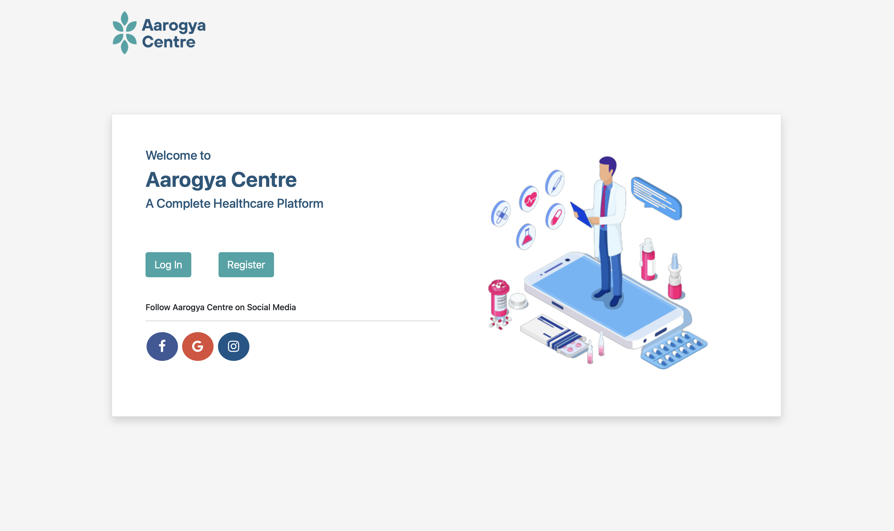

# **Overview**
Aarogya Centre is a comprehensive healthcare platform that enables users to manage their medical needs efficiently. Users can create profiles, book appointments, chat with an AI-powered chatbot for minor health queries, and consult doctors via video or voice calls. The platform also allows users to scan and store their medical documents for easy access and manage appointments for family members.

## **Tech Stack**
- **Frontend**: HTML, CSS, JS, Bootstrap, Jinja
- **Backend**: Flask
- **Database**: PostgreSQL
- **Chatbot**: NumPy, Pandas, Scikit-learn, Bag-of-Words Model
- **Video/Voice Chat**: WebRTC

## **Features**
1. **User Profile Management**: Users can create and manage their profiles.
2. **Appointment Booking**: Schedule appointments for themselves or family members.
3. **AI-Powered Chatbot**: Get quick responses for minor health-related queries using an NLP-based chatbot.
4. **Doctor Consultation**: Secure video and voice calls with doctors using WebRTC.
5. **Medical Document Storage**: Scan and store medical records for easy access.
6. **Family Member Management**: Add family members to the profile and book appointments for them.

## **Screenshots & Visuals**
### **Login**


### **Dashboard**


### **Chatbot Interaction**


### **Profile**


# **Installation & Setup**
## **Prerequisites**
- Python 3.8+
- PostgreSQL Database
- Node.js

## Application Setup
1. Clone the repository:
```sh
git clone https://github.com/PrathameshLakawade/Aarogya-Centre.git
```
2. Create a virtual environment and install dependencies:
```sh
python -m venv venv
source venv/bin/activate  # On Windows: venv\Scripts\activate
pip install -r requirements.txt
```
3. Set up environment variables (`.env` file):
```sh
# Database Configurations
HOST='your-database-host'
PORT='your-database-port'
DATABASE='your-databse-name'
USERNAME='your-datbase-username'
DATABASE_PASSWORD='your-database-password'

# Email Configurations
SERVER='your-email-server'
PORT='your-email-port'
EMAIL='your-email-address'
EMAIL_PASSWORD='your-password'
USE_TLS='true/false'
USE_SSL='true/false'
```
4. Start the Flask server:
```sh
python3 main.py
```

# Usage
1. Sign up and create a profile.
2. Book an appointment for yourself or a family member.
3. Use the chatbot for quick medical queries.
4. Start a video or voice call consultation with a doctor.
5. Scan and store medical documents for future reference.

# Future Enhancements
- Integration with wearable devices for health tracking.
- AI-powered symptom checker for enhanced chatbot functionality.
- Support for electronic prescriptions and billing.

# Research & Publications
This project is supported by an international research paper:
- **Aarogya Centre - A Complete Healthcare Website**  
  *Published in International Journal for Research in Applied Science & Engineering Technology (IJRASET), 2022*  
  [View Paper](https://www.ijraset.com/best-journal/aarogya-centre-a-complete-healthcare-website)  
  - Author: Prathamesh Lakawade
  - Abstract: During the COVID-19 pandemic, everybody was forced to restrict their human interaction to avoid the spread of coronavirus. All the doctors and other employees in the medical industry were working day and night to eradicate the virus. Getting health-related consultation from doctors was risky as an individual had to physically go to a doctor for a checkup. Artificial Intelligence (AI) is the fastest-growing field and is expanding rapidly in other work sectors including the medical sector. Our proposed system is to develop a platform in which all queries related to health can be fulfilled. To start, every individual will need to create a profile on the platform by providing a few details. The user can insert their previous medical records onto the profile so that they can store their entire medical history in one place. On the platform, there will be three modules, chatbot, video chat, and appointment booking. The chatbot can predict the disease and give healthcare advice according to details provided by the user. In the video chat module, the user will be able to communicate with a doctor through video call or only through chat. In the appointment booking module, users can book an appointment with different doctors and hospitals for checkups. With the help of the platform, an individual can save a lot of time and money for simple health-related problems. The platform would also be beneficial for people living in remote areas as they can easily access good medical consultations.

# License
This project is licensed under the MIT License.